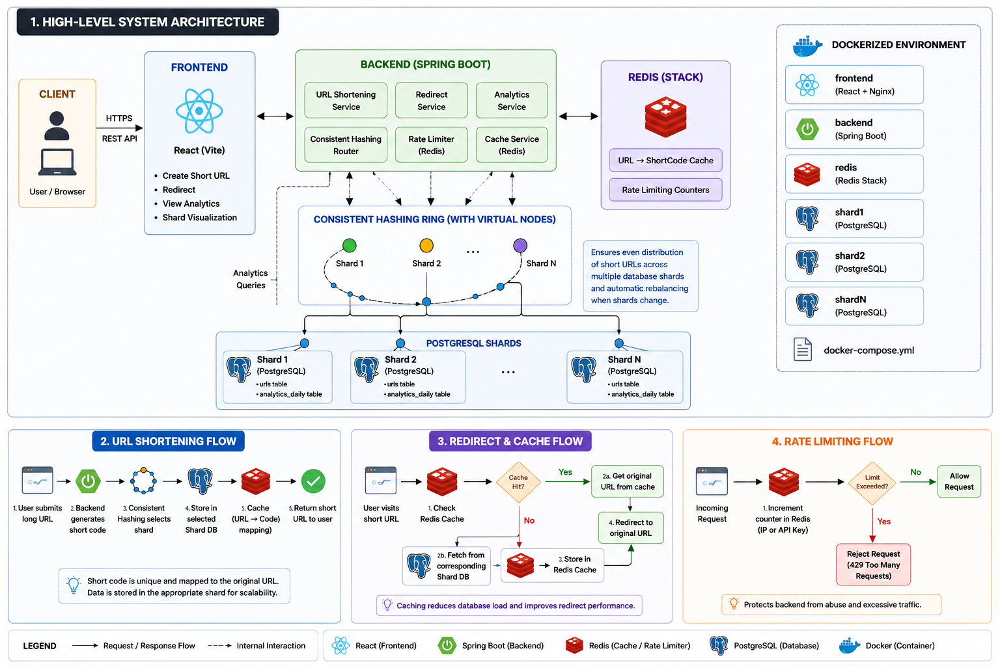
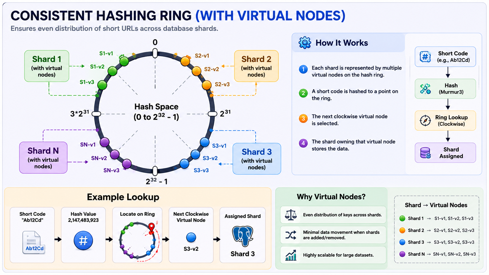
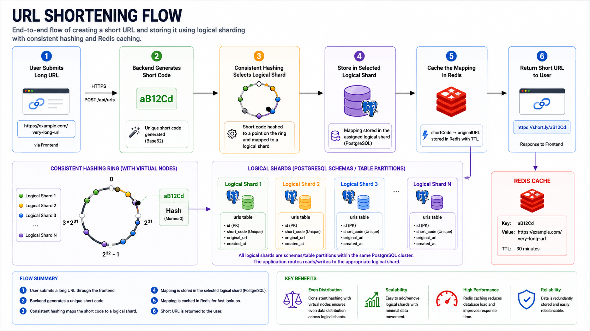
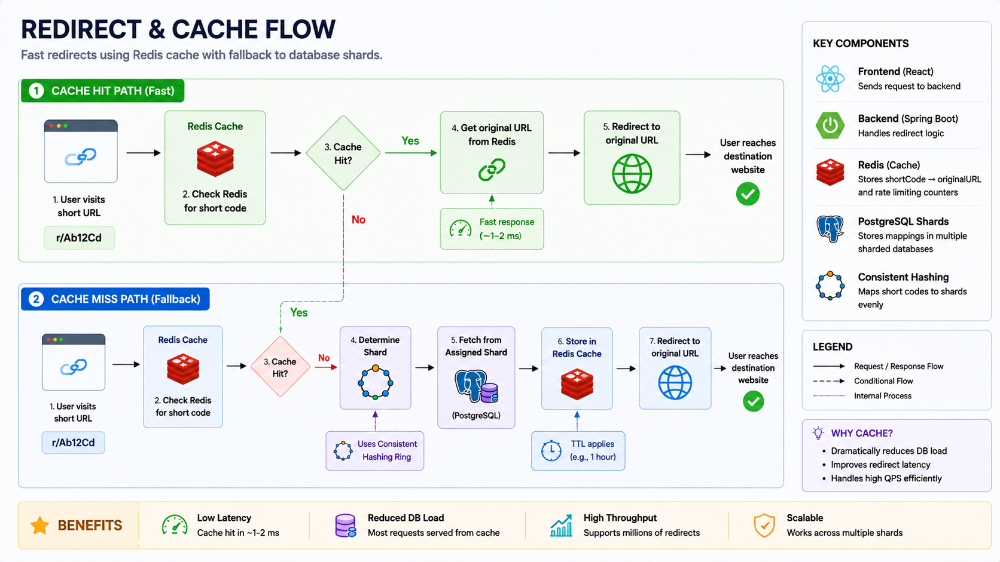
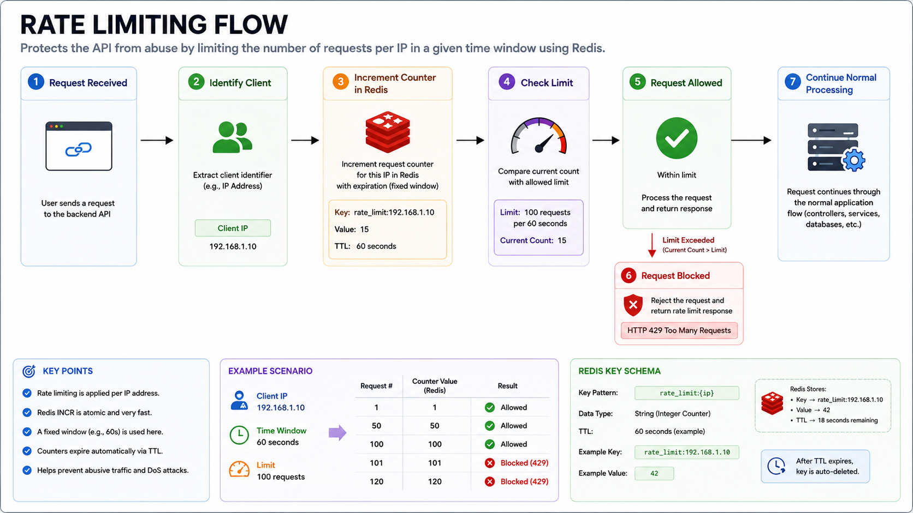
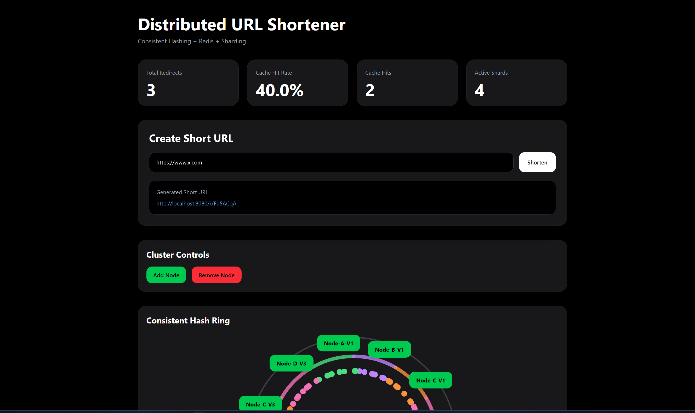
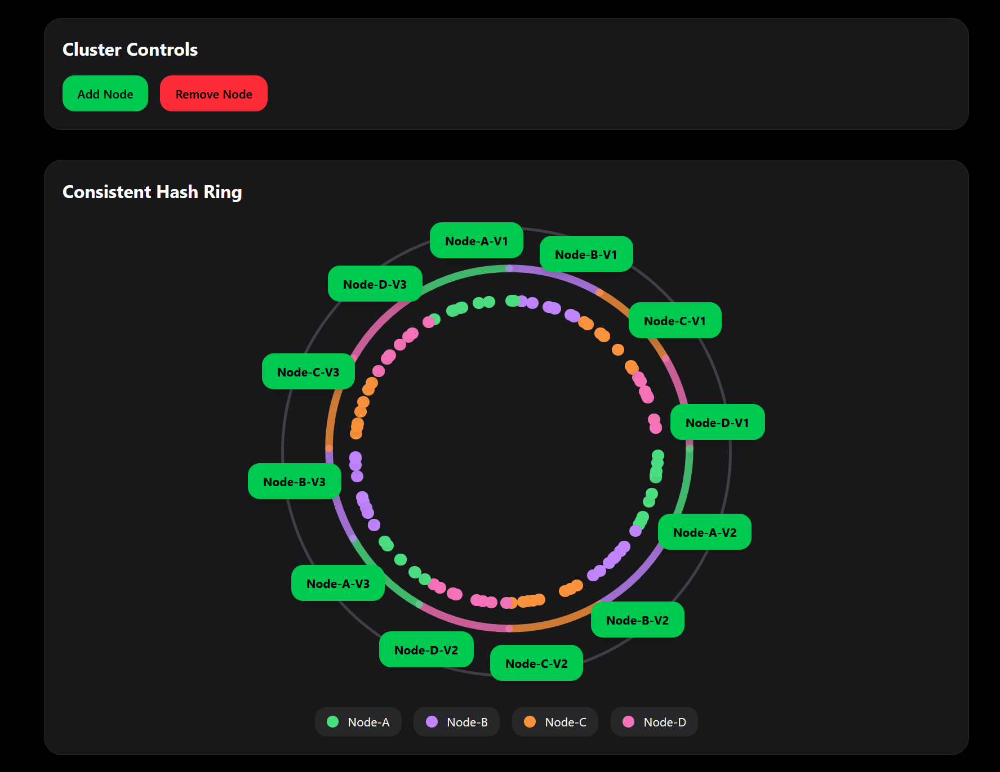
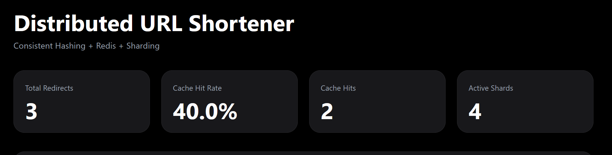

# Distributed URL Shortener (ShardLink)

🔗 **GitHub Repository:** [raftywate/url-shortener-with-consistent-hashing](https://github.com/raftywate/url-shortener-with-consistent-hashing)  
🔗 **Live Demo:** [https://url-shortener-with-consistent-hashi.vercel.app/](https://https://url-shortener-with-consistent-hashi.vercel.app/)

A scalable distributed URL shortener built using **Spring Boot**, **Redis**, **PostgreSQL**, **Consistent Hashing**, **Virtual Nodes**, **Rate Limiting**, and **Docker**.

Designed to simulate real-world distributed backend system concepts including shard routing, cache optimization, node distribution, and fault tolerance visualization.

---

# 🚀 Features

- Distributed URL shortening architecture
- Consistent hashing based shard routing
- Virtual nodes for balanced distribution
- Logical shard routing using PostgreSQL-backed partition ownership
- Redis caching with TTL support
- Rate limiting using Redis
- Redirect analytics tracking
- Interactive hash ring visualization
- Node failure simulation
- Live analytics dashboard
- Dockerized full-stack deployment
- Stateless shard routing architecture
- URL normalization support
- Base62 short code generation

# 🧩 Architecture Decisions

## Why Logical Sharding Instead of Physical DB Shards?

The project currently implements logical shard routing using consistent hashing and virtual nodes within a shared PostgreSQL deployment.

This approach was intentionally chosen to:

- focus on distributed routing logic
- simulate shard ownership
- visualize vnode distribution
- minimize infrastructure complexity during development

The routing layer is designed so physical multi-database sharding can be introduced later with minimal architectural changes.

---

# 🏗️ System Architecture

## High-Level Architecture



---

## Consistent Hashing Ring



---

# 🔄 Request Flows

## URL Shortening Flow



### Flow

1. User submits URL from frontend
2. Backend generates Base62 short code
3. Consistent hashing determines shard ownership
4. URL mapping stored in shard database
5. Global lookup table updated
6. Short URL returned to client

---

## Redirect + Cache Flow



### Flow

1. User hits shortened URL
2. Redis cache checked first
3. Cache hit → immediate redirect
4. Cache miss → shard lookup
5. Result cached with TTL
6. Redirect response returned

---

## Rate Limiting Flow



### Flow

1. Request received
2. Redis counter incremented
3. Threshold checked
4. Allowed requests continue
5. Excess requests rejected with rate limit response

---

# 🧠 Distributed Systems Concepts

## Consistent Hashing

The project uses consistent hashing to distribute short URLs across shards.

### Benefits

- Minimal redistribution during node addition/removal
- Better scalability
- Predictable shard ownership
- Reduced remapping cost

---

## Virtual Nodes

Each physical shard is represented by multiple virtual nodes on the hash ring.

### Benefits

- Better load balancing
- Reduced hotspot formation
- More even distribution
- Improved scaling behavior

---

## Stateless Routing

The backend dynamically determines shard ownership using consistent hashing instead of maintaining persistent database connection state.

### Benefits

- Better scalability
- Safer concurrent request handling
- Easier horizontal scaling
- Reduced connection leakage risks

---

# ⚡ Redis Caching

Redis is used for:

- URL redirect caching
- TTL-based cache expiration
- Rate limiting counters
- Analytics metrics

### Benefits

- Faster redirects
- Reduced database load
- Lower latency
- Improved throughput

---

# 📊 Analytics Dashboard

The frontend dashboard includes:

- Redirect analytics
- Cache hit/miss metrics
- Shard distribution metrics
- Hash ring visualization
- Node ownership visualization
- Node failure simulation
- Live telemetry polling

---

# 🛠️ Tech Stack

## Backend

- Java
- Spring Boot
- Spring Data JPA
- PostgreSQL
- Redis

## Frontend

- React
- Vite
- TailwindCSS
- Axios

## DevOps

- Docker
- Docker Compose

---

# 🐳 Docker Setup

## Clone Repository

```bash
git clone https://github.com/raftywate/url-shortener-with-consistent-hashing.git
cd url-shortener-with-consistent-hashing
```

## Run Application

```bash
docker compose up --build
```

---

## Services

| Service    | Port |
| ---------- | ---- |
| Frontend   | 5173 |
| Backend    | 8080 |
| PostgreSQL | 5432 |
| Redis      | 6379 |

---

# 🌐 API Endpoints

## Create Short URL

```
POST/Shorten
```

### Request Body

```
{
"url" : "https://www.example.com"
}
```

---

## Redirect URL

```
GET/r/{shortCode}
```

---

## Analytics

```
GET/analytics
```

---

# 📸 Screenshots

## Dashboard



---

## Hash Ring Visualization



---

## Analytics Cards



---

# 📈 Scalability Considerations

The architecture is designed to simulate scalable distributed backend behavior:

* Stateless routing
* Shard-based partitioning
* Cache-first redirects
* Horizontal scalability concepts
* Virtual node distribution
* Reduced remapping during scaling

---

# 🧩 Architecture Decisions

## Why Logical Sharding Instead of Physical DB Shards?

The project currently implements logical shard routing using consistent hashing and virtual nodes within a shared PostgreSQL deployment.

This approach was intentionally chosen to:

- focus on distributed routing logic
- simulate shard ownership
- visualize vnode distribution
- minimize infrastructure complexity during development

The routing layer is designed so physical multi-database sharding can be introduced later with minimal architectural changes.

---

# ⚙️ How this Demo Works

To help interviewers and reviewers understand the choices made in this demo, the following features and parameters are implemented:

## 1. Automated Demo Seeding & Live Traffic
To resolve the "cold start" and "empty graph" issue typical of new deployments, a `DemoSeeder` runs automatically on startup, runs on an hourly schedule, and simulates ongoing traffic.
* **Seeded Entry Tagging**: Seeded URLs are tagged with an `is_demo = true` column in PostgreSQL to isolate them from organic user shortened URLs.
* **Realistic Metrics Warming**: The seeder inserts **26 distinct, realistic URLs** and simulates initial redirect hits with random visit distributions (between 2 and 6 visits per code).
* **Live Traffic Simulation**: A background scheduled task in `DemoSeeder.java` simulates active user redirects every 5 seconds. This causes the total redirects count to grow dynamically, resulting in an organic, climbing step-up curve on the Redirect Activity line chart rather than a static, flat line.
* **Jittered History on Load**: Upon opening the dashboard, the frontend generates a jittered 15-point historical step-up curve leading up to the current total redirect count to immediately display a realistic activity history.
* **Idempotency & TTL Alignment**: Running the seeder multiple times will not duplicate mappings. The hourly refresh keeps Redis warmed despite its 1-minute TTL expiration.

## 2. Load Testing & Shard Performance Benchmarks
To back up the scalability claim, we ran a load test suite using `autocannon` targeting a single shard configuration vs. a three logical shard configuration under **500 concurrent connections** sustained for **20 seconds**.

### Benchmark Comparison: 1 Shard vs. 3 Shards

| Configuration | Concurrency | Total Requests | Requests/Sec | p50 Latency | p90 Latency | p99 Latency |
|---|---|---|---|---|---|---|
| **1 Active Shard** | 500 VUs | 37,852 | 1,892.75 req/s | 195 ms | 439 ms | 1,280 ms |
| **3 Active Shards** | 500 VUs | 40,580 | 2,029.20 req/s | 182 ms | 409 ms | 1,311 ms |

> [!NOTE]
> **Performance Caveat**: Because the logical database shards in this project share a single underlying PostgreSQL instance, there is no physical network or physical disk I/O isolation. Hence, the throughput numbers are bounded by the database connection pool limit and CPU bottlenecks on the shared Postgres container, resulting in similar throughput profiles. In a production cluster with separate database nodes, physical sharding would show linear scaling.

## 3. Interactive Ring Simulation & Dashboard Enhancements
* **Live Failover Simulation**: Shards under Cluster Controls can be toggled between **Active** and **Offline**. Taking a shard offline immediately hides its virtual nodes, changes its colored arc to a dashed gray line, and causes the predecessor node's segment to stretch clockwise to assume its range. All mapped URL dots on the ring instantly slide and recolor to show range rebalancing in real-time.
* **Live Hashing Dot Animations**: Newly shortened URLs in the visitor's session are mapped to stable coordinates on the ring using character-sum string hashing. They render as larger, pulsing, colored circles with expanding ripple pings and hover tooltips detailing short path, click metrics, and owner shard mappings.
* **Virtual Nodes Topology**:
  * **Backend**: Each database shard registers **100 virtual nodes** to maintain a balanced key distribution.
  * **Frontend**: Shows **3 virtual nodes** per physical node purely for visual simplicity and label readability.
* **Sleek Light/Dark Theming**: A header toggle allows switching between a deep charcoal dark theme and a clean, high-contrast light theme. Charts, SVGs, and card styles adapt colors dynamically.
* **Circular SVG Health Gauge**: The Cache Hit Rate card features a circular progress ring that changes color dynamically based on cache health (emerald green for hot cache >70%, amber for moderate >40%, rose/red for cold cache).
* **Copy & QR Generator**: The shortening card features click-to-copy clipboard buttons with feedback states, and togglable QR code drawers for mobile camera scanning.

---

# 🔮 Future Improvements

* Kubernetes deployment
* Prometheus + Grafana observability
* Distributed Redis cluster
* Kafka-based analytics pipeline
* ClickHouse analytics storage
* JWT authentication
* Custom aliases
* URL expiration support
* Multi-region deployment
* Distributed tracing

---

# 🧪 Local Development

## Backend

```
cd backend
mvn spring-boot:run
```

---

## Frontend

```
cd frontend
npm install
npm run dev
```

---


## Environment Variables

Copy the example file:

```bash
cp .env.example .env
```

Then configure the required values before running the application.

---


# 👨‍💻 Author

**Abhishek Kumar Gupta**

Distributed Systems | Backend Engineering | Java | Spring Boot
